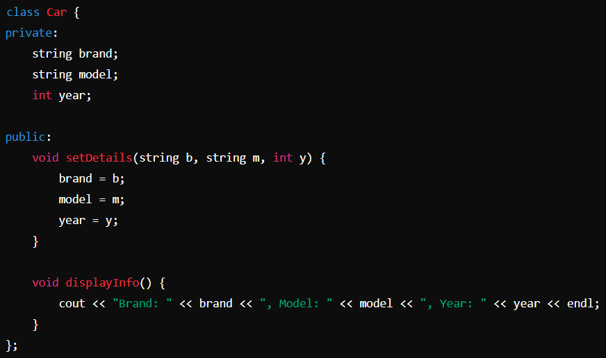
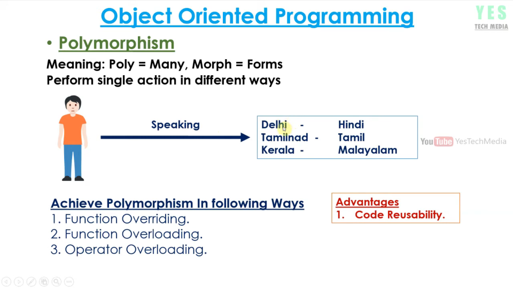
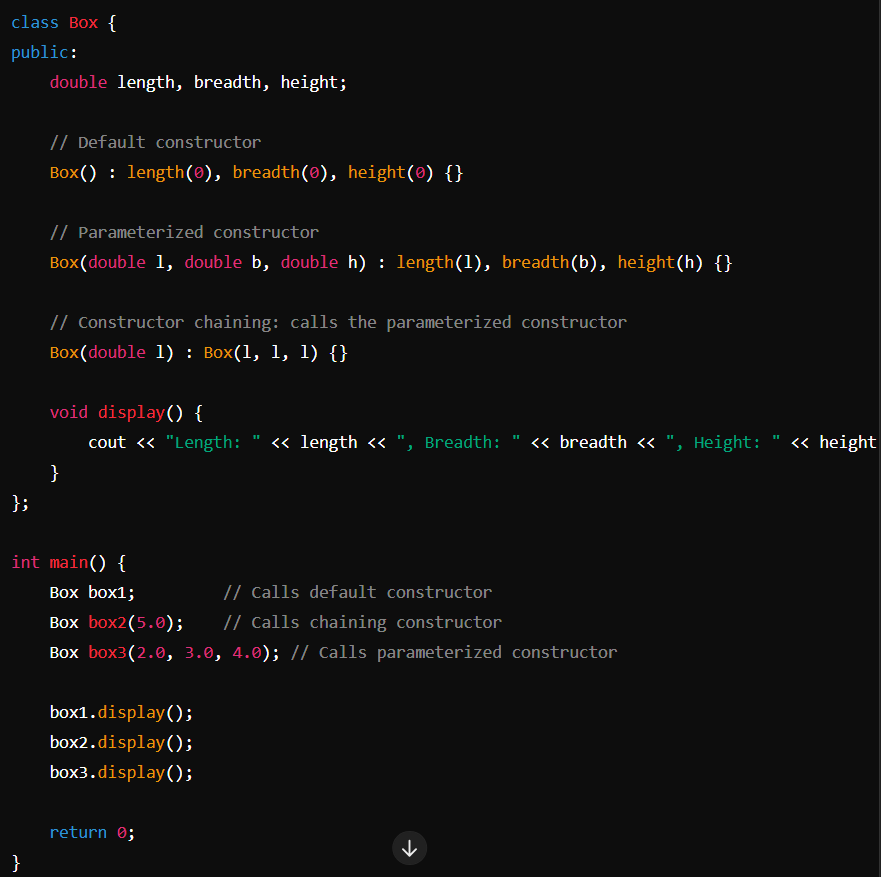
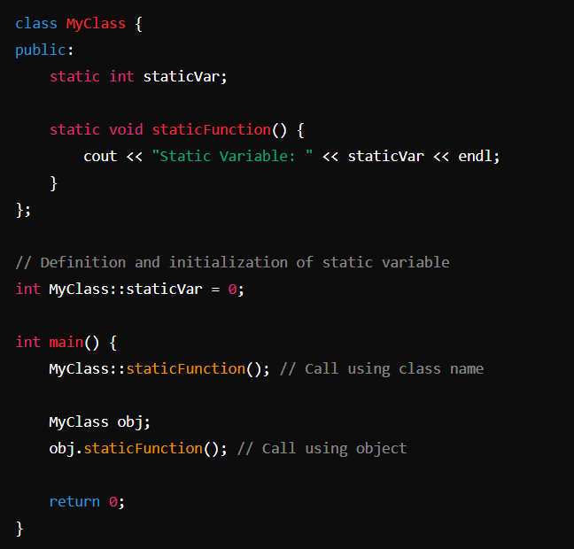
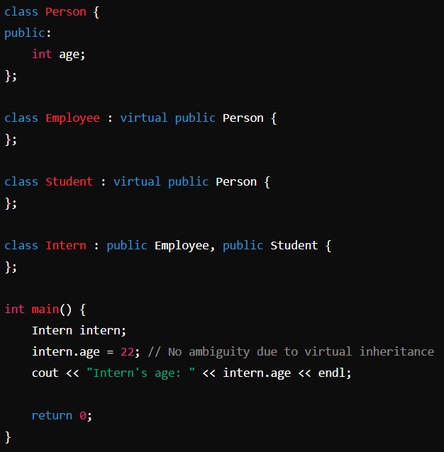

# Object-Oriented Programming (OOP) Concepts

**Author:** Abhinav P Pradeep 

## Classes and Objects

### What is a Class?

- **Building Block of OOP**: The foundational element in object-oriented programming.
- **User-defined Data Type**: A class is a template that defines data members (attributes) and member functions (methods).
- **Blueprint and Logical Representation**: A class provides the structure and behavior but doesn't hold data itself until instantiated.

```cpp
class Car {
public:
    string brand;
    string model;
    int year;
    
    void displayInfo() {
        cout << "Brand: " << brand << ", Model: " << model << ", Year: " << year << endl;
    }
};
```

- **Member Function Outside/Inside Class**: You can define member functions inside or outside the class.

**Outside Example:**

```cpp
void Car::displayInfo() {
    cout << "Brand: " << brand << ", Model: " << model << ", Year: " << year << endl;
}
```

- **Data Member**: Always defined inside the class.

### What is an Object?

- **Instance of a Class**: An object is a specific implementation of a class.
- **Usage of Data Members and Methods**: To access the data members and methods of a class, you need to create an object.
- **Physical Representation**: While a class is a conceptual framework (logical), an object is the actual entity created from the class (physical).

**Example:**

```cpp
int main() {
    Car myCar;
    myCar.brand = "Toyota";
    myCar.model = "Corolla";
    myCar.year = 2020;
    myCar.displayInfo();
    return 0;
}
```

**Class vs. Object**: Think of the class as a recipe (logical), and the object as the actual dish made from the recipe (physical).

### Access Specifiers

- **public**: Members are accessible from outside the class.
- **private**: Members are accessible only within the class. They cannot be accessed directly from outside the class.
- **protected**: Members are accessible within the class and by derived classes (inheritance).

```cpp
class Car {
private:
    string brand;
    string model;
    int year;
public:
    void setDetails(string b, string m, int y) {
        brand = b;
        model = m;
        year = y;
    }
    void displayInfo() {
        cout << "Brand: " << brand << ", Model: " << model << ", Year: " << year << endl;
    }
};

int main() {
    Car myCar;
    // myCar.brand = "Toyota"; // Error: 'brand' is private
    // myCar.model = "Corolla"; // Error: 'model' is private
    // myCar.year = 2020; // Error: 'year' is private
    myCar.setDetails("Toyota", "Corolla", 2020); // Accessible
    myCar.displayInfo(); // Accessible
    return 0;
}
```

## Main Features of OOP

- Encapsulation
- Data Abstraction
- Polymorphism
- Inheritance

### Encapsulation

- **Definition**: Encapsulation is the binding of data and member functions into a single unit such that sensitive data is hidden from the users.
  - **Data hiding**: Restricts access to the members of an object, i.e., private and protected members in C++.
  - **Bundling of data and methods together**: Data members and member methods are wrapped into a single unit known as a class.


### Abstraction

- **Definition**: Abstraction is showing only the necessary information and hiding the other irrelevant information from the user, i.e., hiding the implementation details.
  - **Real-life example**: A man driving a car. The driver knows how to drive but doesn't need to know the internal workings of the engine.





### Polymorphism

- **Definition**: Polymorphism means having many forms. It is the ability of a message to be displayed in more than one form.
  - **Example**: A man can be a father, a husband, and an employee, exhibiting different behaviors in different instances.



**Types of Polymorphism:**

- **Compile Time (Static Binding)**: Binding of function to object is at compile time. Inheritance is not involved.
- **Run Time (Dynamic Binding)**: Binding of function to object is at run time. Inheritance is involved.


#### Compile Time Polymorphism (Function Overloading)


#### Run Time Polymorphism (Inheritance and Virtual Functions)


### Function Overloading

- **Definition**: Function overloading is defining multiple functions with the same name in the same class but with different parameter lists (number of arguments, type of arguments, order of arguments).

**How Function Overloading Works:**

- **Exact Match**: If a function call exactly matches one of the overloaded functions (name and parameters), that function is called.
- **Promotion**: If an exact match is not found:
  - char, unsigned char, and short are promoted to int.
  - float is promoted to double.
- **Standard Conversion**: If no match is found, C++ tries to find a match through standard type conversion.
- **Error**: If no suitable match is found, the compiler throws an error.

### Constructors

#### What is a Constructor?

A **constructor** is a special type of member function in a class that initializes objects of that class. It is automatically called when an object of the class is created. The primary purpose of a constructor is to initialize data members of the class to appropriate values.

**Key Characteristics of Constructors:**

- **Same Name as the Class**: A constructor has the same name as the class in which it resides.
- **No Return Type**: Constructors do not have a return type, not even void.
- **Automatically Called**: Constructors are called automatically when an object is created.
- **Can Be Overloaded**: Multiple constructors can be defined in a class with different parameter lists (constructor overloading).
- **In public**

**Types of Constructors:**

- **Default Constructor**: A constructor that takes no arguments.
- **Parameterized Constructor**: A constructor that takes one or more arguments.
- **Copy Constructor**: A constructor that initializes an object using another object of the same class.


#### Constructor Overloading

- **Definition**: Constructor overloading is a form of compile-time polymorphism where multiple constructors are defined in the same class with different parameter lists (number of arguments, type of arguments, order of arguments).


**Example:**

### Operator Overloading

- **Definition**: Operator overloading allows giving a special meaning to an existing operator without changing its actual meaning. It's mainly used for user-defined data types (e.g., adding two class objects).

**Notes:**

- Some operators cannot be overloaded: sizeof, ::, ., ?:.
  - :: scope resolution
  - . member selection
  - .* member selection through pointer to function
  - ?: ternary operator
- Syntax: RETURN_TYPE operator OPERATOR_SYMBOL (ARGUMENT)

**Points to Remember:**

- **Unary Operator**: No need to pass an argument.
- **Binary Operator**: Need to pass one argument.
- **Destructor**: Cannot be overloaded.
- **Friend Function**: Can be used to overload operators for non-member functions.


#### Binary Operator Overloading

```cpp
#include <iostream>
using namespace std;

class Complex {
private:
    float real;
    float imag;
public:
    // Constructor to initialize real and imaginary parts
    Complex(float r = 0, float i = 0) : real(r), imag(i) {}
    
    // Overloading the binary + operator
    Complex operator+(const Complex &c) {
        // Create a temporary Complex object to hold the result
        Complex temp;
        temp.real = real + c.real; // Add the real parts
        temp.imag = imag + c.imag; // Add the imaginary parts
        return temp; // Return the result
    }
    
    // Function to display the complex number
    void display() const {
        cout << "(" << real << " + " << imag << "i)" << endl;
    }
};

int main() {
    // Create two Complex objects
    Complex c1(3.0, 2.0);
    Complex c2(1.0, 7.0);
    
    // Add the two Complex objects using the overloaded + operator
    Complex c3 = c1 + c2;
    
    // Display the result
    c3.display(); // Output: (4 + 9i)
    return 0;
}
```

#### Friend Operator Overloading

Friend functions are functions that are not members of a class but have access to its private and protected members. This is useful for operator overloading, especially when you want to overload an operator that interacts with two different classes or when the operator needs to access private data members directly.

**Example: Overloading the + Operator with a Friend Function**

```cpp
#include <iostream>
using namespace std;

class Complex {
private:
    float real;
    float imag;
public:
    // Constructor to initialize real and imaginary parts
    Complex(float r = 0, float i = 0) : real(r), imag(i) {}
    
    // Friend function to overload the binary + operator
    friend Complex operator+(const Complex &c1, const Complex &c2);
    
    // Function to display the complex number
    void display() const {
        cout << "(" << real << " + " << imag << "i)" << endl;
    }
};

// Definition of the friend function to overload the + operator
Complex operator+(const Complex &c1, const Complex &c2) {
    // Create a temporary Complex object to hold the result
    Complex temp;
    temp.real = c1.real + c2.real; // Add the real parts
    temp.imag = c1.imag + c2.imag; // Add the imaginary parts
    return temp; // Return the result
}

int main() {
    // Create two Complex objects
    Complex c1(3.0, 2.0);
    Complex c2(1.0, 7.0);
    
    // Add the two Complex objects using the overloaded + operator
    Complex c3 = c1 + c2;
    
    // Display the result
    c3.display(); // Output: (4 + 9i)
    return 0;
}
```

### Virtual Functions

#### What is a Virtual Function?

A virtual function is a member function declared in the base class using the keyword virtual and can be overridden in a derived class. The purpose of a virtual function is to achieve runtime polymorphism.

- **Declaration and Overriding**:
  - **Base Class**: Declared using the virtual keyword.
  - **Derived Class**: Can be overridden (redefined).
- **Execution**:
  - If the derived class does not override the virtual function, the base class version is executed.
  - **Virtual Destructor**: A class can have a virtual destructor but not a virtual constructor.
- **Usage**:
  - To achieve runtime polymorphism, a base class pointer/reference is used, which can hold the address of a derived class object.
  - The virtual keyword ensures the function call is bound at runtime based on the actual object type.
- **Real-life Example**:
  - Consider a traffic signal scenario where vehicles are a base class with a virtual function move().
  - Derived classes like Car, Bicycle, and Bus override the move() function.
  - When various vehicles need to move, the overridden move() function is called based on the actual vehicle.


#### Pure Virtual Functions and Abstract Classes

**Pure Virtual Function**

A pure virtual function is a function that has no implementation in the base class and must be overridden in any derived class. It is declared by assigning 0 in its declaration.

**Abstract Class**

An abstract class is a class that cannot provide implementations for all its functions. It contains at least one pure virtual function. You cannot create objects of an abstract class.

**Key Points:**

- **Definition**:
  - **Abstract Class**: A class with at least one pure virtual function.
  - **Pure Virtual Function**: Declared by assigning 0 in the declaration, e.g., virtual void move() = 0;.
- **Purpose**:
  - Abstract classes provide a base for other classes to derive from, ensuring certain functions are implemented in derived classes.
- **Instantiation**:
  - You cannot create objects of abstract classes directly.
  - Abstract classes can have pointers and references to abstract class types.
- **Constructors and Destructors**:
  - Abstract classes can have constructors and destructors.
  - The destructor of an abstract class is usually declared virtual to ensure proper cleanup of derived class objects.
- **Real-life Example**:
  - Consider an Animal class that has a pure virtual function move(). Different animals (derived classes) like Dog, Bird, and Fish will implement the move() function in their own way.


**Explanation:**

- **Animal Class**:
  - Declares a pure virtual function move(), making it an abstract class.
  - The destructor is virtual to ensure proper cleanup.
- **Dog Class**:
  - Inherits from Animal and overrides the move() function.
- **Bird Class**:
  - Inherits from Animal and overrides the move() function.
- **Main Function**:
  - Demonstrates runtime polymorphism using a base class pointer (animal) to call the overridden move() function in derived classes (Dog and Bird).

**Summary**

- **Abstract Class**: Cannot be instantiated and contains at least one pure virtual function.
- **Pure Virtual Function**: Must be overridden in any derived class.
- **Runtime Polymorphism**: Achieved by using base class pointers or references to call overridden functions in derived classes.
- **Virtual Destructor**: Ensures proper cleanup of derived class objects when deleted through a base class pointer.

### Destructors

#### Understanding Destructors

A destructor is a special member function of a class that is executed when an object of that class is destroyed. It is used to clean up resources that the object may have acquired during its lifetime. This can include deallocating memory, closing file handles, or releasing other resources.

**Key Points About Destructors:**

- **Name**:
  - A destructor has the same name as the class, preceded by a tilde (~).
  - Example: For a class named MyClass, the destructor is ~MyClass().
- **No Parameters**:
  - Destructors do not take any parameters.
  - You cannot overload a destructor.
- **No Return Type**:
  - Destructors do not have a return type, not even void.
- **Automatic Call**:
  - The destructor is called automatically when an object goes out of scope or is explicitly deleted.
- **Single Destructor per Class**:
  - Each class can have only one destructor.
- **Inheritance**:
  - In the context of inheritance, destructors in the base and derived classes are called in reverse order of their construction.

#### Virtual Destructors

A virtual destructor ensures that the destructor of the derived class is called when a base class pointer pointing to a derived class object is deleted. This is crucial for proper resource cleanup and avoiding memory leaks.

**Why Virtual Destructors Are Important**

When you delete a derived class object through a base class pointer, if the base class destructor is not virtual, only the base class destructor is called. This can lead to incomplete destruction of the derived class object and potential resource leaks.


**Output:**

```sql
Base Destructor called
```

In this case, the Derived class destructor is not called because the Base class destructor is not virtual. This can cause resource leaks if the Derived class allocates resources that need to be explicitly released in its destructor.

**Example With Virtual Destructor**

```cpp
#include <iostream>
using namespace std;

class Base {
public:
    virtual ~Base() { // Virtual destructor
        cout << "Base Destructor called" << endl;
    }
};

class Derived : public Base {
public:
    ~Derived() {
        cout << "Derived Destructor called" << endl;
    }
};

int main() {
    Base* b = new Derived();
    delete b; // Both Derived and Base Destructors are called
    return 0;
}
```

**Output:**

```sql
Derived Destructor called
Base Destructor called
```

With the virtual destructor in place, both the Derived class destructor and the Base class destructor are called, ensuring proper cleanup of the derived class object.

**How It Works:**

- **Base Class with Virtual Destructor**:
  - The Base class declares a virtual destructor: virtual ~Base().
  - This tells the compiler to use runtime polymorphism for the destructor, ensuring the correct destructor is called for the actual object type.
- **Derived Class Destructor**:
  - The Derived class defines its own destructor: ~Derived().
  - When the derived class object is deleted through a base class pointer, the derived class destructor is called first, followed by the base class destructor.

**Key Points:**

- **Virtual Destructors**:
  - Ensure that the destructors of derived classes are called, allowing for complete and proper cleanup.
  - Use the virtual keyword to indicate that the destructor should use runtime polymorphism.
- **Resource Management**:
  - Prevents resource leaks by ensuring derived class resources are released properly.
  - Important for classes that manage dynamic memory or other resources that require explicit release.
- **Polymorphism**:
  - Virtual destructors are part of the mechanism that allows polymorphic behavior in C++.
  - Necessary for classes intended to be used polymorphically through base class pointers or references.

**Summary**

- **Without Virtual Destructor**: Only the base class destructor is called when deleting a derived class object through a base class pointer, potentially leading to resource leaks.
- **With Virtual Destructor**: Both the derived class and base class destructors are called, ensuring complete and proper cleanup of the object.
- **Usage**: Always declare a virtual destructor in a base class if it is intended to be inherited by other classes and used polymorphically.

**Note**: If a base class pointer holds the address of a derived class and we delete the base class pointer, only the base class destructor is called unless the base class destructor is virtual.

### Inheritance

#### Overview of Inheritance

Inheritance is a key feature of Object-Oriented Programming (OOP) that allows a new class (derived class) to inherit properties and behaviors (data members and member functions) from an existing class (base class). It promotes code reusability and establishes a natural hierarchy between classes.

**Key Concepts:**

- **Base Class (Parent Class)**: The class whose properties and methods are inherited by another class.
- **Derived Class (Child Class)**: The class that inherits from the base class.

**Why Use Inheritance?**

- **Code Reusability**: Inherits properties and methods from the base class, reducing code duplication.
- **Logical Hierarchy**: Establishes a logical hierarchy between classes, making the code easier to understand and maintain.
- **Extensibility**: Allows the creation of new functionalities based on existing code.

#### Types of Inheritance

- **Single Inheritance**: A derived class inherits from a single base class.
  - **Example**: Vehicle -> Car

```cpp
class Vehicle {
    // Base class code
};

class Car : public Vehicle {
    // Derived class code
};
```

- **Multiple Inheritance**: A derived class inherits from more than one base class.
  - **Example**: Father -> Son; Mother -> Son

```cpp
class Father {
    // Base class code
};

class Mother {
    // Base class code
};

class Son : public Father, public Mother {
    // Derived class code
};
```

- **Multilevel Inheritance**: A derived class inherits from another derived class.
  - **Example**: Animal -> Cat -> RussianBlue

```cpp
class Animal {
    // Base class code
};

class Cat : public Animal {
    // Derived class code
};

class RussianBlue : public Cat {
    // Derived class code
};
```

- **Hierarchical Inheritance**: Multiple derived classes inherit from a single base class.
  - **Example**: Animal -> Cat; Animal -> Dog

```cpp
class Animal {
    // Base class code
};

class Cat : public Animal {
    // Derived class code
};

class Dog : public Animal {
    // Derived class code
};
```

- **Hybrid Inheritance**: A combination of two or more types of inheritance.
  - **Example**: A complex inheritance pattern involving multiple and hierarchical inheritance.

```cpp
class Human {
    // Base class code
};

class Boy : public Human {
    // Derived class code
};

class Girl : public Human {
    // Derived class code
};

class Male : public Boy {
    // Derived class code
};

class Female : public Girl {
    // Derived class code
};
```

#### Constructors in Inheritance

Constructors in derived classes can call constructors in base classes. This is especially important for parameterized constructors.

- **Default Constructor**: Automatically called if no other constructor is specified.
- **Parameterized Constructor**: Must explicitly specify the base class's parameterized constructor in the initialization list.


#### Destructors in Inheritance

Destructors in derived classes are called in the reverse order of the constructors. The destructor of the derived class is called first, followed by the destructor of the base class.


**Output:**

```sql
Derived Destructor called
Base Destructor called
```

#### Accessing Base Class Members

- **Inheritance**: The derived class inherits public and protected members from the base class. Private members are not accessible directly but can be accessed through public or protected member functions.
- **Friend Class**: A derived class can access private members of a base class if the base class declares the derived class as a friend.


**Summary**

- **Inheritance**: Enables creating new classes from existing classes, promoting code reuse and logical hierarchy.
- **Types**: Includes single, multiple, multilevel, hierarchical, and hybrid inheritance.
- **Constructors**: Parameterized constructors of base classes must be explicitly called in derived classes.
- **Destructors**: Called in the reverse order of construction to ensure proper cleanup.
- **Access**: Derived classes can access public and protected members of base classes, with private members accessible through friend classes or member functions.

### Friend Functions and Classes

#### Friend Function

A friend function is a function that is not a member of a class but can access the private and protected members of the class. It acts as a bridge between two classes by accessing their private data.

**Key Points:**

- **Not a Member Function**:
  - It is not a member of any class.
  - Declared inside the class but defined outside the class.
- **Access**:
  - Can access private and protected members of the class where it is declared as a friend.
- **Declaration and Definition**:
  - Declared inside the class using the friend keyword.
  - Defined outside the class.
- **Call**:
  - Called like a normal function, not using the object and dot operator.


#### Friend Class

A friend class is a class that is declared as a friend of another class, allowing it to access private and protected members of the class where it is declared as a friend.

**Key Points:**

- **Access**:
  - Can access private and protected members of the class where it is declared as a friend.
- **Declaration**:
  - Declared inside the class using the friend keyword.
- **Scope**:
  - A friend class can be declared in public, protected, or private sections of the class.


### Constructor Chaining

**Definition:**

Constructor chaining is a technique in object-oriented programming where one constructor calls another constructor within the same class. It helps reduce code duplication and make the program simpler.



**Explanation:**

- The Box class has three constructors.
- The default constructor initializes the dimensions to zero.
- The parameterized constructor initializes the dimensions to the given values.
- The constructor with one parameter calls the parameterized constructor with the same value for all dimensions, demonstrating constructor chaining.

### Static Keyword

#### Static Variables

**Inside Function:**

- **Lifetime**: The space for a static variable inside a function is allocated once, and it retains its value between function calls.


**Inside Class:**

- **Shared by all objects**: Only one copy of the static variable is created for all objects of the class.
- **Initialization**: Automatically initialized to 0.
- **Declaration**: Inside the class.
- **Definition**: Outside the class.


#### Static Members of Class

**Static Member Function:**

- Can only access static variables.
- Called using the class name or an object.



**Static Data Members:**

- **Static data members** are shared among all objects of a class. They are not tied to any particular object.
- **Non-static data members** are unique to each object of the class.

**Static Member Functions:**

- **Static member functions** can only access static data members because they are not associated with any object of the class.
- **Non-static member functions** can access both static and non-static data members because they operate on an object of the class and have access to the this pointer.

**Example:**


### Constant Variables and Functions

#### Constant Variable

**Definition:**

A constant variable is a variable whose value cannot be changed after it has been initialized. In C++, the const keyword is used to define constant variables.

**Key Points:**

- **Fixed value**: Once assigned, the value of a constant variable cannot be altered.
- **Initialization**: Must be initialized at the time of declaration.
- **Usage in C++**: Constant data members should be initialized using a constructor initializer list.


#### Constant Member Function

**Definition:**

A constant member function is a member function that does not modify the state of the object. It can be called on constant objects.

**Key Points:**

- **Const objects**: An object declared as const cannot be modified.
- **Const member function**: A member function that guarantees not to alter the object's data members.
- **Syntax**: Declared by adding const keyword after the function declaration.


### The 'this' Pointer

**Definition:**

The this pointer in C++ is a special pointer that is implicitly passed to all non-static member functions of a class. It points to the object for which the member function is called.

**Key Points:**

- **Current Object Address**: this is used to retrieve the address of the current object, given in hexadecimal format.
- **Distinguishing Data Members**: It helps to distinguish between class data members and local variables when both have the same name.


**Explanation:**

- this->x refers to the data member x of the current object.
- Without this, x = x; would not distinguish between the parameter and the data member, leading to ambiguity.

### Virtual Inheritance (Diamond Problem)

**Definition:**

The diamond problem occurs in multiple inheritance when two superclasses of a class have a common base class. This can lead to ambiguity and duplication of inherited members.

**Key Points:**

- **Superclass**: A class whose properties are inherited by a subclass.
- **Diamond Shape**: The inheritance structure forms a diamond shape.
- **Multiple Copies**: Without virtual inheritance, the subclass gets two copies of the common base class attributes.



**Explanation:**

- **Virtual Inheritance**: The virtual keyword ensures that the Person class's attributes are shared and not duplicated in the Intern class, avoiding ambiguity.

### Structure vs. Class

**Structures:**

- **Default Access Specifier**: Public.
- **Inheritance**: Limited support (typically not used for inheritance).
- **Data Encapsulation**: Primarily used for data grouping.
- **Usage**: Generally used for passive objects with public data members.

**Classes:**

- **Default Access Specifier**: Private.
- **Inheritance**: Full support, used extensively.
- **Data Encapsulation**: Supports data hiding and encapsulation.
- **Usage**: Used for creating active objects with both data members and member functions.

### Reference vs. Pointer

**References:**

- **Syntax**: Declared using &.
- **Nullability**: Cannot be null.
- **Reassignment**: Cannot be reassigned to reference another object after initialization.
- **Usage**: Safer and easier to use, preferred when possible.

**Pointers:**

- **Syntax**: Declared using *.
- **Nullability**: Can be null.
- **Reassignment**: Can be reassigned to point to different objects.
- **Usage**: More powerful, allows for dynamic memory management.

### new vs. malloc

**new:**

- **Type Safety**: Returns the correct type.
- **Initialization**: Calls constructors.
- **Syntax**: Operator.
- **Exception Handling**: Throws an exception if memory allocation fails.

**malloc:**

- **Type Safety**: Returns void* (requires casting).
- **Initialization**: Does not call constructors.
- **Syntax**: Function.
- **Exception Handling**: Returns NULL if memory allocation fails.

### Scope Resolution Operator

**Definition:**

The scope resolution operator (::) is used to define the scope of a function or variable, specifically when the same name exists in different scopes.

**Key Points:**

- **Global Scope**: Access global variables when there's a local variable with the same name.
- **Class Scope**: Define member functions outside the class definition.
- **Namespace Scope**: Access elements of a namespace.


### Interfaces

**Definition:**

An interface is a class with only pure virtual functions. It defines a contract that derived classes must fulfill.

**Key Points:**

- **Pure Virtual Functions**: Functions declared by assigning 0 in the declaration.
- **No Implementation**: Derived classes must provide implementations for the pure virtual functions.
- **Abstract Classes**: Interfaces are abstract classes.


**Explanation:**

- **Pure Virtual Function**: show() is declared as a pure virtual function in the Interface class.
- **Derived Class**: Implementation class provides the implementation for the show() function.